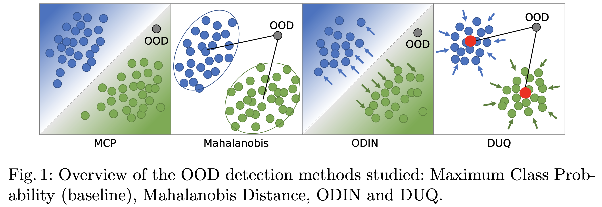
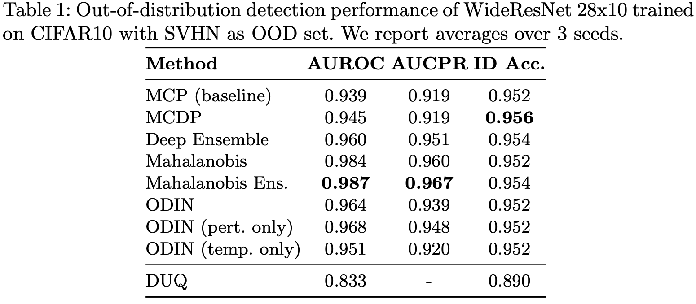
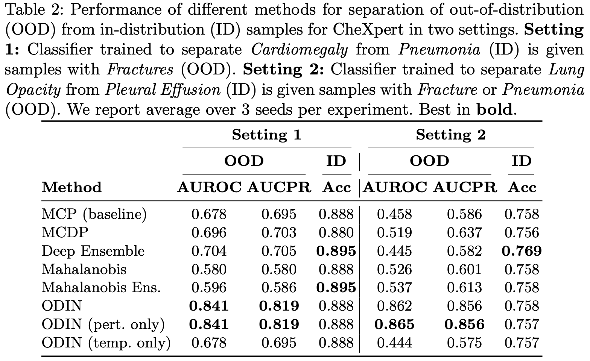

# OOD Detection Framework
Code for our paper **Confidence-based Out-of-Distribution Detection: A Comparative Study and Analysis**

> Berger, Christoph, Magdalini Paschali, Ben Glocker, and Konstantinos Kamnitsas. "Confidence-based Out-of-Distribution Detection: A Comparative Study and Analysis." arXiv preprint arXiv:2107.02568 (2021).
### Intro 


Implemented methods: 
* Maximum Class Probability
* Deep Ensembles
* ODIN
* Mahalanobis Distance
* Center Loss 
* Mahalanobis Ensemble
* Monte Carlo Dropout
* Monte Carlo Dropout Ensemble

## Usage Instructions
### Datasets
The code works with CIFAR10 vs SVHN and with CheXpert OOD detection tasks. CIFAR10 and SVHN are automatically downloaded via torchvision. For CheXpert, download `CheXpert-v1.0-small` and place the folder in `datasets`. 
The current default settings for CheXpert can be found in `config\chexpert.py` and are categorized in 2 settings we trained on (see table 2).

### Requirements
This code was developed and tested on `Python 3.8`. Install all the required packages from `requirements.txt`. Both training and inference need a supported Nvidia GPU.

### Training
Train new models using `train_wrn_cifar10.py` or `train_wrn_chexpert.py`. To adapt the default settings, edit the `config` files for the respective datasets. The defaults values yielded the best results in our training. You might have to adapt the batch size to fit the datasets on your GPU. We also made use of Weights and Biases for data logging, you can disable or enable that via a command line arg (`--wandb`). 

### Evaluation
Run `eval_chexpert.py -h` or `eval_cifar10.py -h` to see which methods you can run. You can also specify the exact IDs of pretrained models in the config to set which one the code loads. 

### Reference Results
#### CIFAR10 vs SVHN

#### CheXpert


## Repositories that helped assemble this collection of baselines
* WideResNet from https://github.com/meliketoy/wide-resnet.pytorch/blob/master/config.py
* Values from SVHN for normalization: https://deepobs.readthedocs.io/en/develop/_modules/deepobs/pytorch/datasets/svhn.html
* Mahalanobis: https://github.com/pokaxpoka/deep_Mahalanobis_detector
* ODIN: https://github.com/facebookresearch/odin
* DUQ: https://github.com/y0ast/deterministic-uncertainty-quantification

## How to cite

Please cite as:
```
Berger, Christoph, Magdalini Paschali, Ben Glocker, and Konstantinos Kamnitsas. "Confidence-based Out-of-Distribution Detection: A Comparative Study and Analysis." arXiv preprint arXiv:2107.02568 (2021).
```
BibTeX:
```bibtex
@article{berger2021confidence,
  title={Confidence-based Out-of-Distribution Detection: A Comparative Study and Analysis},
  author={Berger, Christoph and Paschali, Magdalini and Glocker, Ben and Kamnitsas, Konstantinos},
  journal={arXiv preprint arXiv:2107.02568},
  year={2021}
}
```